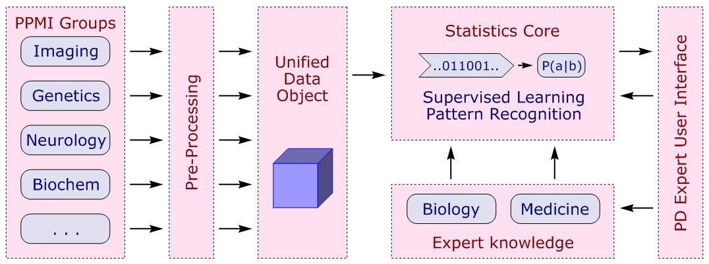

Project PD-LEARN
================

Analyze Data from a Large Parkinson's Clinical Study - a project in cooperation with <a href="http://www.zipfianacademy.com">Zipfian Academy</a> and <a href="www.bayesimpact.org">Bayes Impact</a>.

### Author

*Christian Bracher* 
[cbracher69@gmail.com](mailto:cbracher69@gmail.com) 
July 2014

### Overview

<a href="http://en.wikipedia.org/wiki/Parkinson's_disease">Parkinson's Disease</a> (PD) is a slowly progressing neurodegenerative disease that has a significant prevalence in the general population:  About 1 in 300 people in the U.S. have PD, and about 60,000 new cases are diagnosed each year.  While there are medications that treat symptoms, the disease itself is incurable and invariably disables patients physically and mentally over time, leading to a high financial and societal burden on healthcare systems and caretakers.  Despite its prevalence, very little is known about the causes of PD, and possible cures remain a distant prospect.

PPMI, the <a href="http://www.ppmi-info.org/">Parkinson's Progression Markers Initiative</a>, is a large scale, $60M study of Parkinson's Disease spearheaded by the Michael J. Fox Foundation.  PPMI is a longitudinal study of about 1,000 subjects that combines an extensive array of measurements of population, behavioral, neurological, clinical, imaging, and genetic traits, and follows their evolution over time, in the hope of finding markers that predict PD risk, and the course of the disease in individual patients.

### Project Goals

PPMI provides large amounts of data for dozens of independent, often disparate measurements, such as gender, education, olfactory ability, depression, mental ability, biomarkers in blood and cerebrospinal fluid, genetic variants, and various forms of structural and functional imaging, that are in use to diagnose PD, or are suspected to play a role in the pathology of the disease.  Simple correlation studies between pairs of markers are incapable of extracting patterns hidden in this wealth of information.  Advanced statistical techniques like machine learning and pattern recognition promise to yield insights that cannot simply be gained from plotting the data.

This project aims to

* render the data set in a form that is easy to access and control, 
* apply machine learning techniques to elucidate hidden structure in the data,
* provide streamlined access to these methods to researchers not familiar with ML tools and their use, in order to advance exploration of PPMI data,
* evaluate biomarkers for their value in the diagnostics of PD, and to identify population groups at risk,
* establish whether there are distinct subgroups of patients that share the outward symptoms of PD, but differ in the underlying biological or environmental causes of the syndrome.

### A Machine Learning Framework for PD

As mentioned, one of the purposes of the project is to open up the insights yielded by machine learning to experts in the field of Parkinson's disease, few of which are practicioners of data science.  To facilitate access to these individuals, the analysis of the data using machine learning and interpretation of the results should be intuitive, and hide the technical complexity of the process.  

This philosophy is implemented in a three stage design.  PPMI data is available from a central web repository, but comes in form of many individual files containing various assessments; the files also differ slightly in their format.  The framework contains a 'backend' or import module to collect this data:  After some processing, the data is stored in a three-dimensional object, indexed by the timeline (many assessments are repeatedly performed in the study), subject ID, and the test modality itself.  Selecting available data requires familiarity with the study protocol, and is handled using a script.

The data object is available to the statistics core module which handles data selection and slicing, simple statistics protocols, and all the correpondence with the 'frontend' that interfaces with the user.  The core also contains the machine learning unit, and hands rendering jobs to the graphics module.  (Some new display options, particularly suitable for PPMI data, have been developed for this project.)

The 'frontend' is a graphical interface, e.g. a web browser, that lets the user select particular PPMI datasets, suggests modes of analysis, and displays the results in strictly graphical form.  (To keep operation simple, no numerical data is transmitted.)  Although the communication protocol between core and frontend is already fixed, coding the GUI itself remains a work in progress.

The structure of the ML framework is depicted schematically below:

### Folder Contents

The different elements of the project have been separated into several folders.  A quick overview is below; detailed information can be found in each folder.

*	*PPMI Backend* 
	Data ingestion and organization scripts and methods.

*	*PPMI Genetics* 
	Methods to facilitate statistical genome analysis using the PLINK utility.  (Results to be implemented into the data at a later point.)

*	*PPMI Graphics Library* 
	Methods to render one- and two-dimensional data plots as .png images.

*	*PPMI Learn* 
	Machine learning support for the core module.

*	*PPMI Statistics Core* 
	Elements of the module responsible for data selection and analysis, communication with the user interface.

*	*PD-Learn Presentation* 
	A brief presentation of the project, including some preliminary findings.

